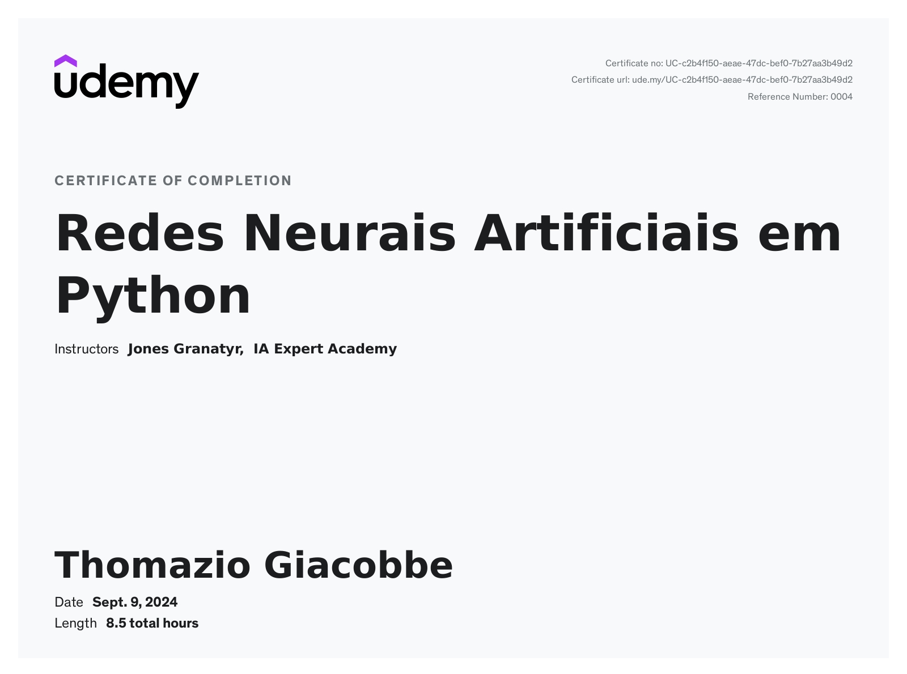

# Neural Networks

This repository contains scripts as part of the Udemy course [Computer Vision Masterclass](https://www.udemy.com/course/computer-vision-masterclass) showcasing concepts of neural networks. The project contains a anaconda environment file with all the necessary dependencies.

